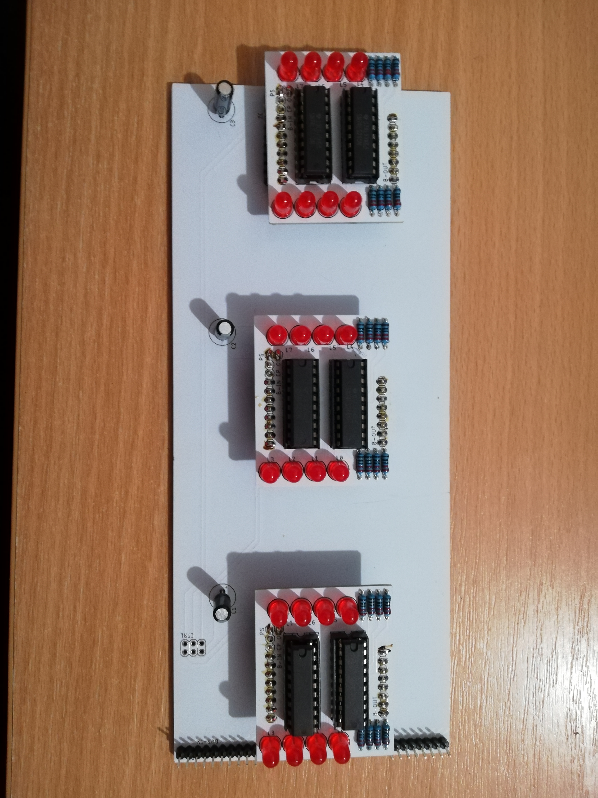

# 8 bit breadboard CPU 

## Sections
1. [Power Supply]
2. Clock  
3. Program Counter  
From 0 to to 8191 (13bit).  
Register will hold the number before loading. Bus is 8bit width (Little-Endian).  
	+ 4x[counter], 2x[register]
	+ Control pins:
  		* INC - Incerement PC. 
  		* LDP - Load from bus.
4. Registers
8bit.  
ACC, X, Y, Z, S???  
	+ 1x[register], 2x[buffer] to Bus.
	+ Control pins:
		* LD - Load from bus.
		* OE - Put on bus.
5. Random Access Memory / Read Only Memory  
Both AT28C64B.  
ROM (13bit address) contain program. PC is directly connected to ROM.    
RAM 13bit address. May be upper 3 bit will be used to control CE, 8 EEPROM so 8x64kbit.  
6. Arithmetic Logic Unit  
7. Control  

## Schematics  
### Registers  
[sch](schematics/Register/Register-sch.pdf) [brd](schematics/Register/Register-brd.pdf)   
### Program Counter
[sch](schematics/PC-ROM/Program-Counter-sch.pdf) [brd](schematics/PC-ROM/Program-Counter-brd.pdf)  
### RAM
[sch](schematics/RAM/RAM-sch.pdf) [brd](scheamtics/RAM/RAM-brd.pdf)
### ALU
[sch](schematics/ALU/ALU-sch.pdf) [brd](scheamtics/ALU/ALU-brd.pdf)

## Fotos

Autor: Matej Dinis.

[counter]: https://www.tme.eu/en/details/74ls193/counters-dividers/texas-instruments/sn74ls193n/
[register]: https://www.tme.eu/en/details/sn74ls273n/flip-flops/texas-instruments/
[buffer]: https://www.tme.eu/en/details/sn74ls245n/buffers-transceivers-drivers/texas-instruments/
[Power Supply]: https://www.tme.eu/en/details/ama12er5-050200y/plug-in-power-supplies/aimtec/
[DIP switch]: https://www.tme.com/us/en-us/details/1825360-5/dip-switches/te-connectivity/
[Comparator]: https://www.tme.eu/sk/details/74ls85/komparatory/texas-instruments/sn74ls85n/
[Adder]: https://www.tme.eu/sk/en/details/nte74ls283/counters-dividers/nte-electronics/
[XOR]: https://www.tme.eu/sk/en/details/nte74ls86/gates-inverters/nte-electronics/